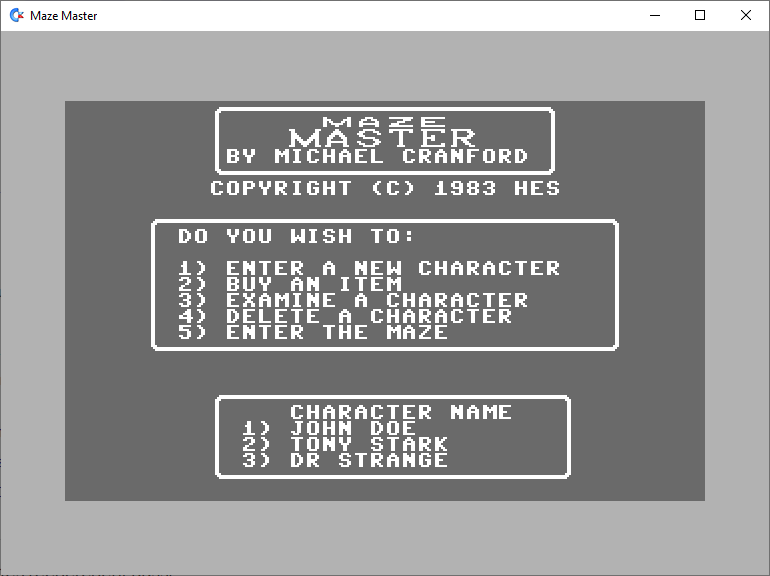
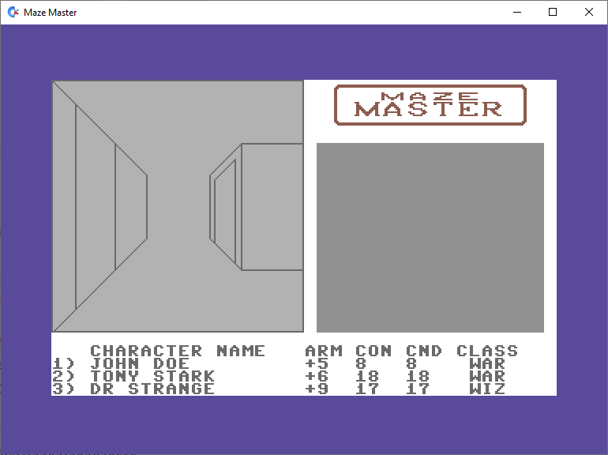
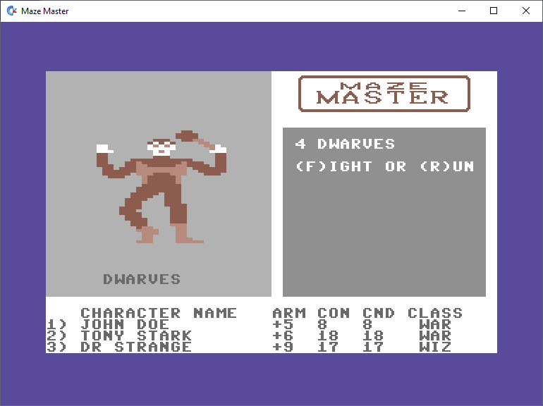

# 🏰 JMazeMaster - Relive the Commodore 64 Experience!

JMazeMaster is a Java implementation of the classic **Maze Master** game, originally released in **1983** on the **Commodore 64**. It was developed by **Michael Cranford**, the creator behind the famous *A Bard's Tale* series. 

This version aims to be as faithful as possible to the original, without using emulation : the complete game logic has been reconstructed in Java by disassembling the binary code from the original cartridge.

## 🎮 Game Overview

Embark on a perilous adventure through dark corridors and hidden passageways, ever wary of lurking monsters that could strike at any moment. In **Maze Master**, you command a party of three characters (wizards and warriors), minimally armed but capable of gaining strength, gold, and powerful magic as they overcome the dangers of the labyrinth. As you progress through the maze, you will uncover clues to a mystical riddle that must be solved to penetrate the final chamber of the **BALROG**, a formidable foe determined to destroy the liege and his realm. Victory is achieved when the BALROG is defeated, and the riddle is solved, restoring peace to the kingdom.

 

## 🛠️ Installation and Compilation

### 📌 Prerequisites
Before getting started, make sure you have installed:
- [Java 11+](https://adoptium.net/)
- [Maven](https://maven.apache.org/)

### 🚀 Installation
Clone the Git repository and navigate to the project directory:
```sh
git clone https://github.com/SPixs/JMazeMaster.git
cd JMazeMaster
```

### 🏗️ Compilation with Maven
To compile the project, use:
```sh
mvn clean package
```
This generates an executable file in `target/JMazeMaster-1.0-SNAPSHOT.jar`.

### 🎲 Execution
#### 🔹 With Maven (quick development run)
```sh
mvn exec:java
```

#### 🔹 Running the Generated JAR
```sh
java -jar target/JMazeMaster-1.0-SNAPSHOT.jar
```

## 🕹️ Reverse Engineering & Original Assembly Code

As part of my effort to faithfully recreate *Maze Master* in Java, I have meticulously **disassembled and documented** the original **6510 assembly code** from the Commodore 64 cartridge.

The fully commented assembly source is available in the repository:

[💾 View the reverse engineered 6510 assembly source code](https://github.com/SPixs/JMazeMaster/blob/main/c64_resources/source.asm)

This resource is invaluable for anyone interested in **reverse engineering**, **retro gaming preservation**, or simply understanding how classic 8-bit games were programmed.

## 📖 Original Game Manual

For a detailed understanding of the game mechanics, including the list of **spells** usable both in and out of combat, as well as the **equipment available for purchase**, you can consult the original game manual:

[📘 View the Maze Master Manual](https://github.com/SPixs/JMazeMaster/blob/main/media/mazeMasterManuel.pdf)

This document provides essential guidance for mastering the game, making strategic decisions, and fully experiencing the adventure.

## 📜 License
This project is distributed under the **MIT** license. See the [LICENSE](LICENSE) file for more information.

## 📷 More Game Screenshots


---
⭐ **If you like this project, don't forget to give it a star on GitHub!** ⭐
